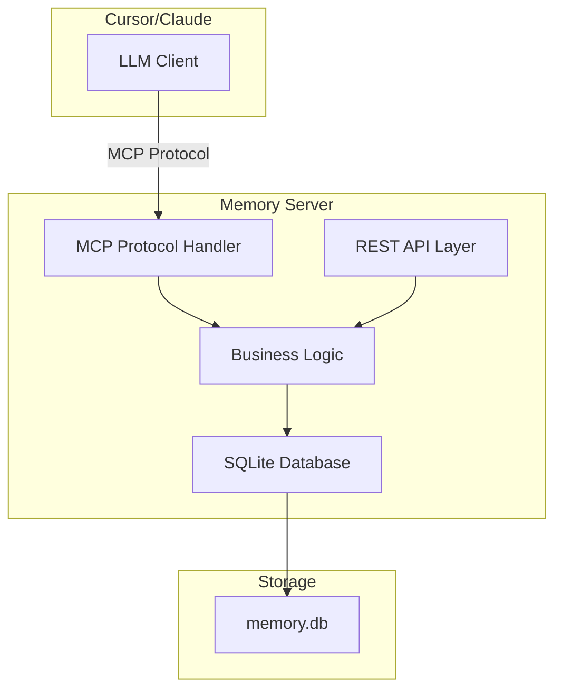

# 設計ドキュメント

## 概要

このメモリサーバーは、Cursor/Claude LLMに長期記憶機能を提供するためのMCP（Model Context Protocol）準拠サーバーです。システムは軽量で持ち運び可能な単一プロセスアーキテクチャを採用し、SQLiteデータベースを使用してローカルでメモリデータを永続化します。

主要な設計目標：
- **軽量性**: 最小限の依存関係とリソース使用量
- **ポータビリティ**: 単一ファイルデータベースによる簡単な移行
- **安定性**: 速度よりも信頼性を優先
- **セキュリティ**: 完全にローカルで動作、外部ネットワーク不要

## アーキテクチャ

### 全体アーキテクチャ



### レイヤー構造

1. **プロトコル層**: MCPプロトコルハンドリング（FastMCP使用）
2. **API層**: HTTP RESTエンドポイント（FastAPI使用）
3. **ビジネスロジック層**: メモリ操作とデータ処理
4. **データアクセス層**: SQLiteデータベース操作

## コンポーネントと インターフェース

### MCPツール定義

#### 1. add_note_to_memory
```python
@mcp.tool
def add_note_to_memory(
    content: str,
    tags: Optional[List[str]] = None,
    keywords: Optional[List[str]] = None,
    summary: Optional[str] = None
) -> dict:
    """メモリにノートを追加する"""
```

#### 2. search_memory
```python
@mcp.tool
def search_memory(
    query: Optional[str] = None,
    tags: Optional[List[str]] = None,
    limit: int = 10
) -> List[dict]:
    """キーワードまたはタグでメモリを検索する"""
```

#### 3. get_project_rules
```python
@mcp.tool
def get_project_rules() -> List[dict]:
    """プロジェクトルールタグ付きメモリを取得する"""
```

#### 4. update_memory_entry
```python
@mcp.tool
def update_memory_entry(
    entry_id: int,
    content: Optional[str] = None,
    tags: Optional[List[str]] = None,
    keywords: Optional[List[str]] = None,
    summary: Optional[str] = None
) -> dict:
    """既存のメモリエントリを更新する"""
```

#### 5. delete_memory_entry
```python
@mcp.tool
def delete_memory_entry(entry_id: int) -> dict:
    """メモリエントリを削除する"""
```

#### 6. list_all_memories
```python
@mcp.tool
def list_all_memories() -> List[dict]:
    """すべてのメモリエントリをメタデータと共に一覧表示する"""
```

### REST APIエンドポイント

#### メモリエントリ管理
- `POST /memories` - 新しいメモリエントリを作成
- `GET /memories` - メモリエントリを検索・一覧表示
- `GET /memories/{id}` - 特定のメモリエントリを取得
- `PUT /memories/{id}` - メモリエントリを更新
- `DELETE /memories/{id}` - メモリエントリを削除

#### 検索とフィルタリング
- `GET /memories/search?q={query}` - キーワード検索
- `GET /memories/tags/{tag}` - タグによるフィルタリング
- `GET /memories/rules` - ルールタグ付きエントリの取得

### ビジネスロジック層

#### MemoryService クラス
```python
class MemoryService:
    def __init__(self, db_path: str):
        self.db_path = db_path
        self.init_database()
    
    def add_memory(self, content: str, tags: List[str] = None, 
                   keywords: List[str] = None, summary: str = None) -> int
    def search_memories(self, query: str = None, tags: List[str] = None, 
                       limit: int = 10) -> List[dict]
    def update_memory(self, entry_id: int, **kwargs) -> bool
    def delete_memory(self, entry_id: int) -> bool
    def get_memory_by_id(self, entry_id: int) -> dict
    def list_all_memories(self) -> List[dict]
```

## データモデル

### メモリエントリテーブル構造

```sql
CREATE TABLE memory_entries (
    id INTEGER PRIMARY KEY AUTOINCREMENT,
    content TEXT NOT NULL,
    tags TEXT,  -- JSON配列として保存
    keywords TEXT,  -- JSON配列として保存
    summary TEXT,
    created_at TIMESTAMP DEFAULT CURRENT_TIMESTAMP,
    updated_at TIMESTAMP DEFAULT CURRENT_TIMESTAMP
);

-- 検索パフォーマンス向上のためのインデックス
CREATE INDEX idx_memory_tags ON memory_entries(tags);
CREATE INDEX idx_memory_keywords ON memory_entries(keywords);
CREATE INDEX idx_memory_created_at ON memory_entries(created_at);
```

### データ構造

#### MemoryEntry
```python
@dataclass
class MemoryEntry:
    id: int
    content: str
    tags: List[str]
    keywords: List[str]
    summary: str
    created_at: datetime
    updated_at: datetime
    
    def to_dict(self) -> dict:
        """辞書形式に変換"""
        
    @classmethod
    def from_dict(cls, data: dict) -> 'MemoryEntry':
        """辞書から作成"""
```

## エラーハンドリング

### エラー分類と対応

#### 1. データベースエラー
- **SQLiteError**: データベース操作失敗
- **対応**: ログ記録、適切なHTTPステータスコード返却、エラーメッセージ提供

#### 2. バリデーションエラー
- **ValidationError**: 入力データの形式不正
- **対応**: 400 Bad Requestとエラー詳細を返却

#### 3. リソース不存在エラー
- **NotFoundError**: 指定されたメモリエントリが存在しない
- **対応**: 404 Not Foundを返却

#### 4. MCPプロトコルエラー
- **MCPError**: MCPプロトコル関連エラー
- **対応**: MCPエラーレスポンス形式で返却

### エラーレスポンス形式

#### REST API
```json
{
    "error": {
        "code": "MEMORY_NOT_FOUND",
        "message": "指定されたメモリエントリが見つかりません",
        "details": {
            "entry_id": 123
        }
    }
}
```

#### MCPツール
```python
{
    "error": {
        "code": -32602,
        "message": "Invalid params",
        "data": {
            "details": "エラーの詳細情報"
        }
    }
}
```

## テスト戦略

### テストレベル

#### 1. 単体テスト
- **対象**: 各ビジネスロジック関数、データアクセス層
- **フレームワーク**: pytest
- **カバレッジ目標**: 90%以上

#### 2. 統合テスト
- **対象**: MCPツール、REST APIエンドポイント
- **テストデータ**: インメモリSQLiteデータベース使用

#### 3. MCPプロトコルテスト
- **対象**: MCPクライアントとの通信
- **ツール**: FastMCPのテストユーティリティ

### テストデータ管理

#### テスト用データベース
- 各テストで独立したインメモリデータベース使用
- テストフィクスチャでサンプルデータ提供
- テスト後の自動クリーンアップ

#### モックとスタブ
- 外部依存関係のモック化（必要に応じて）
- データベース操作のスタブ化（パフォーマンステスト用）

### テスト実行戦略

#### 継続的テスト
```bash
# 全テスト実行
pytest tests/

# カバレッジレポート付き
pytest --cov=main --cov-report=html tests/

# MCPプロトコルテスト
pytest tests/test_mcp_integration.py
```

#### パフォーマンステスト
- 大量データでの検索性能テスト
- 同時接続数テスト
- メモリ使用量監視

## 実装詳細

### 技術スタック
- **Python 3.8+**: メイン言語
- **FastMCP**: MCPプロトコル実装
- **FastAPI**: REST API実装
- **SQLite3**: データベース（Python標準ライブラリ）
- **Uvicorn**: ASGIサーバー

### 設定管理
```python
class Config:
    DATABASE_PATH = "memory.db"
    HOST = "localhost"
    PORT = 8000
    LOG_LEVEL = "INFO"
    MAX_SEARCH_RESULTS = 100
```

### ログ設定
```python
import logging

logging.basicConfig(
    level=logging.INFO,
    format='%(asctime)s - %(name)s - %(levelname)s - %(message)s',
    handlers=[
        logging.FileHandler('memory_server.log'),
        logging.StreamHandler()
    ]
)
```

### セキュリティ考慮事項

#### データ保護
- SQLiteデータベースファイルの適切な権限設定
- SQLインジェクション対策（パラメータ化クエリ使用）
- 入力データのサニタイゼーション

#### アクセス制御
- ローカルホストのみからのアクセス許可
- 不要なネットワークポートの非公開
- ファイルシステム権限の適切な設定

この設計により、要件で定義されたすべての機能を満たしながら、軽量で安定したメモリサーバーを実現できます。